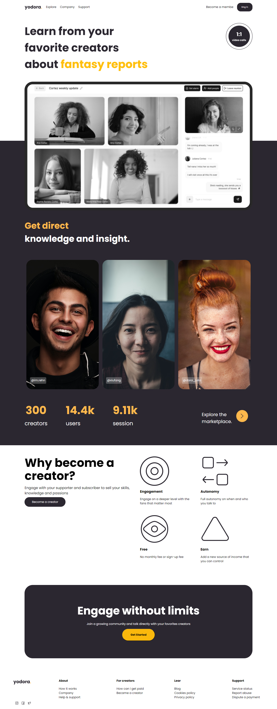

# TeammateCode

Nosso professor decidiu que iriamos fazer nosso primeiro trabalho em grupo. Disso, as esquipes foram sorteadas, e seus templates devidamente separados.

## Time 4 - Template 4
Nosso trabalho foi uma landing page feita em grupo. Cada um fazendo sua parte, e no final juntando tudo. O time 5 era formado por:

- Nathan Ramos
- Mota Araújo
- Lucas Sobral
- Davi Castro (líder)
- Jefferson

## Resultado
A nossa experiência foi muito boa! Conseguimos _codar_ juntos pelo discord, trocar ideias sobre soluções e, pegar afinidade com o versionamento de código via Git. O resultado final foi...

Créditos ao template: [yodora](https://www.figma.com/design/YH2t4SbK7YPwk5wJqwxAY1/Yodora---Landing-Page-Design-%7C-Freebies-by-%40itsrehanraihan-(Community)?node-id=0-1&node-type=canvas&t=X61eHbjrWdg6btDH-0)